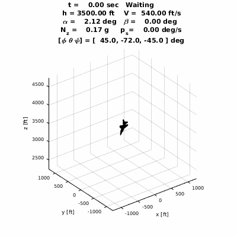


  

## UPDATE:
The original version of this project was marked as [release v1.0.0](https://github.com/pheidlauf/AeroBenchVV/releases/tag/v1.0.0). There are now improvements (and potentially breaking changes) from the original version.

# Quick Start Instructions

- Open Matlab and add src/main and subfolders to the Matlab PATH
- Set src/main as the current working directory.
- Run the SimConfig.m script
- Run src/main/Simulink/AeroBenchSim_2019a.slx or Run src/main/Simulink/AeroBenchSim_2019a.slx
- Process the output by running the graphOutput.m or handleSimResults.m script

# Citation

For citation purposes, please use: "Verification Challenges in F-16 Ground Collision Avoidance and Other Automated Maneuvers", P. Heidlauf, A. Collins, M. Bolender, S. Bak, 5th International Workshop on Applied Verification for Continuous and Hybrid Systems (ARCH 2018)

# AeroBenchVV Overview

This project contains a set of benchmark models and controllers that test automated aircraft maneuvers by performing simulations. The hope is to provide a benchmark to motivate better verification and analysis methods, working beyond models based on Dubin's car dynamics, towards the sorts of models used in aerospace engineering. Compared to actual aerospace models used in practice, however, these models are still very simple. Roughly speaking, the dynamics are nonlinear, have about 10-20 dimensions (continuous state variables), and hybrid in the sense of discontinuous ODEs, but not with jumps in the state. The dynamics are given entirely in human-readable matlab .m code, without the need for additional Matlab toolboxes. Ode45 is used to simulate the system, pass/fail specifications are checked against the simulated maneuver, and a plot (or animation) of the resultant flight path can be generated.

## Real Automated Ground Collision Avoidance System
This benchmark was inspired by a real F-16 GCAS system that was recently developed by Lockheed Martin, NASA, and the Air Force Research Lab. As of the start of 2018, the system has been confirmed as saving six aircraft (~$25 million each) and seven lives. However, this academic benchmark code and recovery logic are in no way connected to the code or methodology used in the real thing. For more information on the real system, including a video of one of the 'confirmed saves', see [this article in Aviation Week](http://aviationweek.com/air-combat-safety/auto-gcas-saves-unconscious-f-16-pilot-declassified-usaf-footage).

## Related Work
A python implementation of the same code library is currently being developed. It is available at https://github.com/stanleybak/AeroBenchVVPython.

## Citations

For citation purposes, please use: "Verification Challenges in F-16 Ground Collision Avoidance and Other Automated Maneuvers", P. Heidlauf, A. Collins, M. Bolender, S. Bak, 5th International Workshop on Applied Verification for Continuous and Hybrid Systems (ARCH 2018)

Other useful references:

[1] Stevens, Brian L., Frank L. Lewis, and Eric N. Johnson. Aircraft control and simulation: dynamics, controls design, and autonomous systems. John Wiley & Sons, 2015.  

[2] Morelli, Eugene A. "Global nonlinear parametric modelling with application to F-16 aerodynamics." American Control Conference, 1998. Proceedings of the 1998. Vol. 2. IEEE, 1998.

[3] Bużantowicz W. "Matlab Script for 3D Visualization of Missile and Air Target Trajectories".International Journal of Computer and Information Technology 5 (2016)5, pp. 419-422.

### Release Documentation

This Release: Distribution A: Approved for Public Release (88ABW-2020-2188)
Original Release: Distribution A: Approved for Public Release (88ABW-2017-6379)
